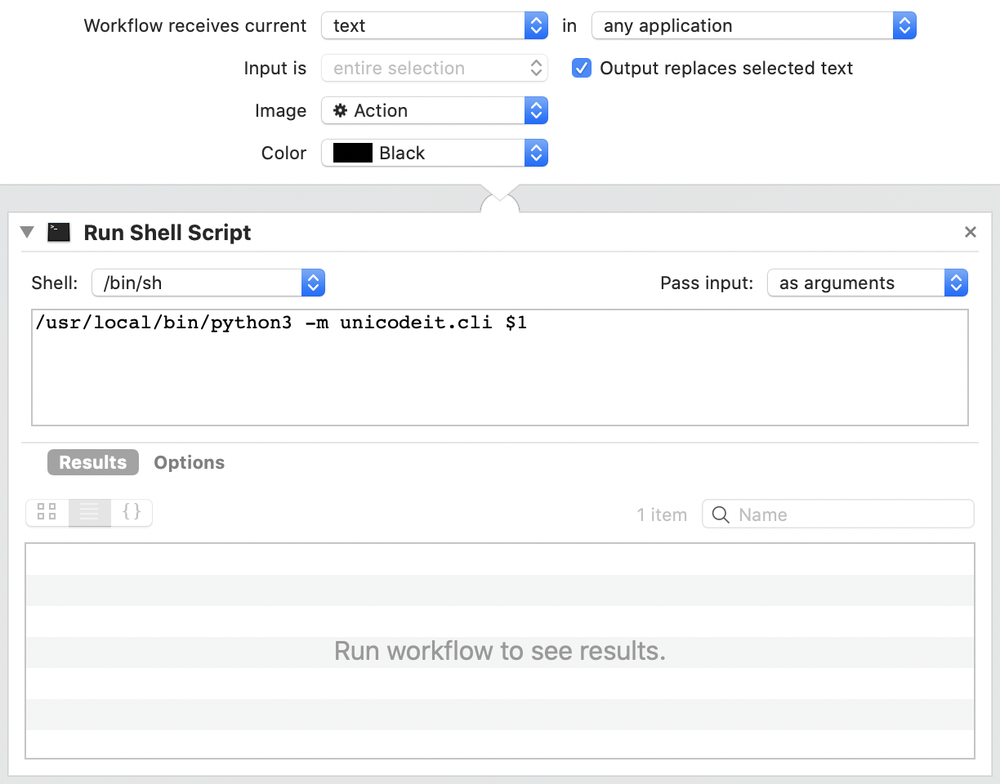

# UnicodeIt

Tested on Linux, Mac and Windows: [](https://travis-ci.org/svenkreiss/unicodeit)

Converts LaTeX tags to unicode.
Available online at [unicodeit.net](https://www.unicodeit.net).


## Examples

```
\alpha α, \beta β, \infty ∞       e^+ e⁺, \mu^- μ⁻               \exists ∃, \nexists ∄
\int ∫, \sum ∑, \partial ∂         \to →, p\bar{p} pp̅             \mathcal{H} ℋ, \mathbb{R} ℝ
\slash{\partial} ∂̸                \underline{x} x̲                \phone ☎, \checkmark ✓
\dot{x} ẋ, \ddot{x} ẍ             A^6 A⁶, m_0 m₀                 \Im ℑ, \Re ℜ, \hbar ℏ
\gamma γ, \Gamma Γ                \~{O} Õ                        \perp ⊥, \parallel ∥
\sfrac{3}{5} ⅗                    \therefore ∴, \because ∵       \subset ⊂, \supset ⊃
```


## Python

Install with `pip install unicodeit` and run

```sh
python -m unicodeit.cli \\alpha
```

or in Python

```py
import unicodeit
print(unicodeit.replace('\\alpha'))
```


## JavaScript / TypeScript

Install with `npm install unicodeit --save-dev` and use it like this:

```js
var unicodeit = require('unicodeit');
console.log(unicodeit.replace('\\alpha'));
```


## Mac Automator

Create your own Automator Workflow:

* Create a new "Service".
* At the top, leave the defaults: "Service receives *selected text* in *any application*"
* Select the checkmark "output replaces selected text".
* Add the action "Run Shell Script".
* From dropdown, select to "pass in: as arguments".
* The command is: `/usr/local/bin/python3 -m unicodeit.cli $1`. This Python interpreter must have unicodeit installed; e.g. with `/usr/local/bin/python3 -m pip install unicodeit`.
* It should look something like this:



To set a keyboard shortcut, go to `System Preferences` →
`Keyboard` → `Shortcuts` → `Services` → `Text` → `UnicodeItAction`.
Choose a keyboard shortcut like `Command+Option+Shift U`.

Now you are all set to use your new keyboard shortcut in many apps, like here in Keynote:


